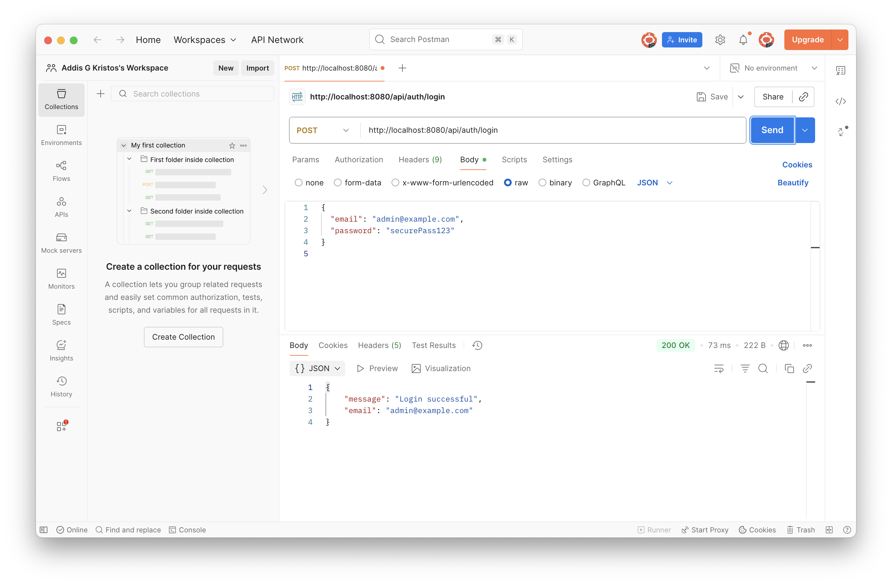
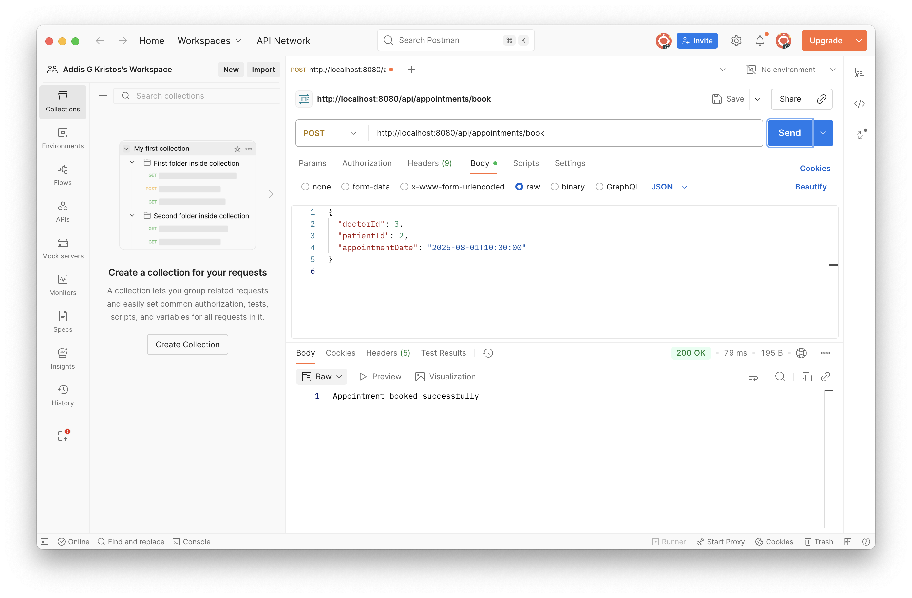

# 🏥 Smart Healthcare Platform API

A Spring Boot backend project that manages **doctors, patients, and appointments** with secure JWT-based authentication, role-based access control, and MySQL database integration.

## ✅ Features

- 👨‍⚕️ Register/Login with `ROLE_ADMIN`, `ROLE_DOCTOR`, and `ROLE_PATIENT`
- 🔐 JWT Authentication with Spring Security
- 📅 Book appointments between patients and doctors
- 🧾 CRUD APIs for Doctors and Patients
- 🛡️ Role-based access restrictions
- 🐬 MySQL integration
- 📦 Docker support for containerization
- 📄 Swagger/OpenAPI documentation

## 🚀 Getting Started

### 1. Clone the Repository

```bash
git clone https://github.com/missiekahsay/smart-healthcare-platform.git
cd smart-healthcare-platform
```

### 2. Configure MySQL

Create a database:

```sql
CREATE DATABASE smart_healthcare;
```

Update `application.properties` with your credentials:

```properties
spring.datasource.url=jdbc:mysql://localhost:3306/smart_healthcare
spring.datasource.username=root
spring.datasource.password=
```

### 3. Run the App

```bash
./mvnw spring-boot:run
```

Visit: [http://localhost:8080](http://localhost:8080)

### 4. Swagger API Docs

Access interactive API docs at:

```
http://localhost:8080/swagger-ui/index.html
```

## 🧪 API Test Flow (Postman)

1. `POST /api/auth/register` – Register a new user
2. `POST /api/auth/login` – Login to receive JWT
3. Use JWT for secured routes (Doctors, Patients, Appointments)
4. `GET /api/doctors` or `/api/patients` etc.

## 🐳 Docker

To build and run with Docker:

```bash
docker build -t smart-healthcare-api .
docker run -p 8080:8080 smart-healthcare-api
```

## 📁 Project Structure

```
src/main/java/com/smarthealth/platform/
├── controller
├── model
├── repository
├── service
├── config
└── SmartHealthcarePlatformApplication.java
```

## 📸 Screenshots

### ✅ Register Endpoint


### 📅 Book Appointment



## 👨‍💻 Author

**Missie Kahsay** – [GitHub](https://github.com/missiekahsay) | [Portfolio](https://missie-portfolio.vercel.app/)

---

© 2025 Smart Healthcare Platform – All rights reserved.